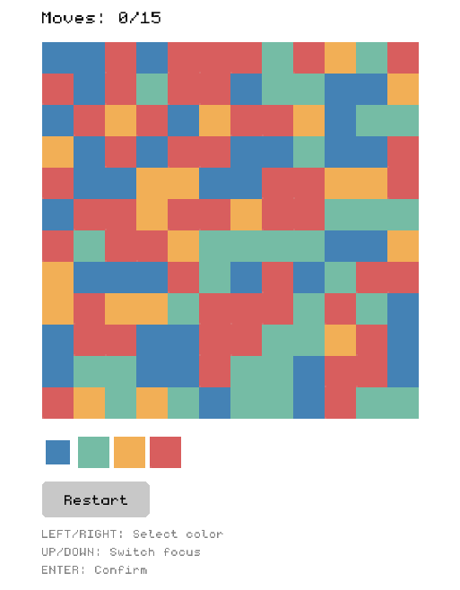

<p align="center">
  <h1>Tiny Flood</h1>
</p>

<p align="center">
  
</p>

<p align="center">
  A tiny clone of the Flood-It game, written in C++ using Raylib.
</p>


## Building from Source

This project is intended to be built with MinGW-w64 on a Windows environment.

### Prerequisites

* **MinGW-w64:** Ensure `g++` and `make` are available in your system's PATH.
* **Raylib:** Download the Raylib library for MinGW.

### Configuration & Compilation

1. **Configure Raylib Path:** Open the `Makefile` and edit the `RAYLIB_DIR` variable to point to the root of your Raylib installation directory.

    ```makefile
    # Adjust this to wherever you unzipped raylib
    RAYLIB_DIR := C:/raylib
    ```

2. **Build the Game:** Open a terminal in the project's root directory and run the `make` command.

    ```sh
    make
    ```

    This will compile the source code and create `tinyflood.exe`.

## Makefile Targets

The `Makefile` provides the following targets:

* `all`: (Default) Builds the executable.
* `run`: Builds the game (if necessary) and runs it.
* `clean`: Removes compiled object files and the executable.

